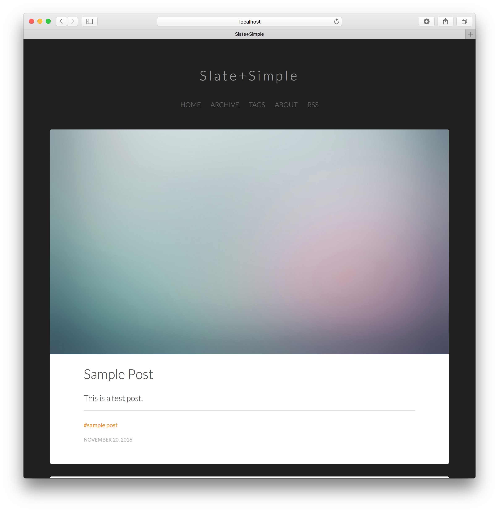

# Slate+Simple Jekyll Theme

Slate+Simple is a sleek and minimalistic theme for Jekyll blogs. It is based on the [Clean+Simple Theme](https://github.com/nathanrooy/Clean-and-Simple-Jekyll-Theme) by [Nathan Rooy](https://nathanrooy.github.io). 

[Live demo.](https://benradford.github.io)

Slate+Simple is a light-on-dark theme that features crisp typography and includes featured images for posts. It is easily modified and provided under the MIT open source license to encourage community modifications and improvements. 

<figure>

</figure>

YAML headers include support for:

* title
* subtitle
* author
* featured-image
* date-string
* categories
* tags

Additionally, Slate+Simple supports [MathJax](https://www.mathjax.org) for beautiful equations and [Font Awesome](http://fontawesome.io/icons/). LaTeX math wrapped in `$$` will automatically compile to in-line or block images of formatted equations. Font awesome icons are included with the `i` tag. For example: `<i class='fa fa-github-alt'></i>`.

